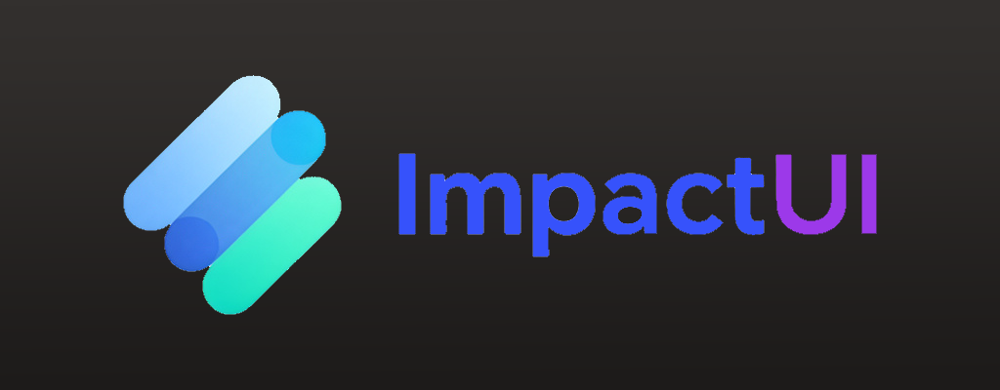

# ImpactUI Library

A sleek, modern GUI library for Roblox Lua scripting.



---

## Installation

### Method 1: Loadstring (Recommended)
```lua
local ImpactGUI = loadstring(game:HttpGet("YOUR_RAW_URL_HERE"))()
```

### Method 2: Direct Copy
Copy the `main.lua` file content and paste it into your script.

---

## Quick Start

```lua
-- Load the library
local ImpactGUI = loadstring(game:HttpGet("YOUR_RAW_URL"))()

-- Create a window
local Window = ImpactGUI:CreateWindow({
    Name = "My Amazing Script",
    Width = 550,
    Height = 400,
})

-- Add a tab
local CombatTab = Window:AddTab("Combat")
local VisualsTab = Window:AddTab("Visuals")
local SettingsTab = Window:AddTab("Settings")

-- Add sections to tabs
local AimbotSection = CombatTab:AddSection("Aimbot")
local OtherSection = CombatTab:AddSection("Other")

-- Add UI elements
AimbotSection:AddToggle("Aimbot Enabled", false, function(value)
    print("Aimbot:", value)
end)

AimbotSection:AddSlider("FOV", 0, 180, 50, function(value)
    print("FOV:", value)
end)

OtherSection:AddButton("Kill All", function()
    print("Killing everyone!")
end)

Window:Notify("Script Loaded!", "Welcome to my script", 3)
```

---

## Options

| Option | Type | Default | Description |
|--------|------|---------|-------------|
| `Name` | string | "Impact GUI" | Window title |
| `Width` | number | 550 | Window width |
| `Height` | number | 400 | Window height |
| `Position` | UDim2 | Center | Window position |
| `Key` | KeyCode | RightControl | Key to show window |
| `ToggleKey` | KeyCode | nil | Key to toggle visibility |
| `Theme` | string | "Dark" | Theme name |

---

## Available Themes

```lua
Window:SetTheme(ImpactGUI.Themes.Dark)      -- Default dark theme
Window:SetTheme(ImpactGUI.Themes.Light)     -- Light theme
Window:SetTheme(ImpactGUI.Themes.Synthwave) -- Synthwave/Cyberpunk
Window:SetTheme(ImpactGUI.Themes.Midnight)  -- Midnight blue
Window:SetTheme(ImpactGUI.Themes.Emerald)   -- Green emerald
Window:SetTheme(ImpactGUI.Themes.Blood)     -- Dark red theme
Window:SetTheme(ImpactGUI.Themes.Galaxy)    -- Purple galaxy
Window:SetTheme(ImpactGUI.Themes.Ocean)     -- Blue ocean
```

---

## UI Elements

### Toggle
```lua
local toggle = Section:AddToggle("Name", defaultValue, callback)

-- Methods
toggle:Set(true/false)        -- Set value
toggle:Destroy()              -- Remove toggle
```
> Default value: boolean

---

### Slider
```lua
local slider = Section:AddSlider("Name", min, max, default, callback)

-- Methods
slider:Set(value)             -- Set value
slider:Destroy()              -- Remove slider
```
> Returns numbers. Supports decimals.

---

### Dropdown
```lua
local dropdown = Section:AddDropdown("Name", {"Option1", "Option2", "Option3"}, "Default", callback)

-- Methods
dropdown:Refresh({"New", "Options"}, callback)  -- Update options
dropdown:Set("Option")                           -- Set selection
dropdown:Destroy()                               -- Remove dropdown
```

---

### Keybind
```lua
local keybind = Section:AddKeybind("Name", Enum.KeyCode.E, callback)

-- Methods
keybind:Listen()    -- Start listening for input
keybind:Destroy()   -- Remove keybind
```
> Click the button to rebind. Press ESC to clear.

---

### TextBox
```lua
local textbox = Section:AddTextBox("Name", "default text", "placeholder", callback)

-- Methods
textbox:Set("new text")      -- Set value
textbox:Destroy()            -- Remove textbox
```

---

### Label
```lua
local label = Section:AddLabel("Some text here")

-- Methods
label:Set("New text")        -- Update text
label:Destroy()              -- Remove label
```

---

### Button
```lua
local button = Section:AddButton("Click Me!", function()
    print("Button clicked!")
end)

-- Methods
button:Click()     -- Trigger callback
button:Destroy()   -- Remove button
```

---

### Color Picker
```lua
local colorPicker = Section:AddColorPicker("Color", Color3.fromRGB(255, 85, 255), function(color)
    print("Color changed to:", color)
end)

-- Methods
colorPicker:Set(Color3.fromRGB(100, 100, 100))
```

---

### Separator
```lua
Section:AddSeparator()
```
> Adds a horizontal line to separate elements.

---

### Info Box
```lua
Section:AddInfoBox("This is an info message", "info")    -- Blue accent
Section:AddInfoBox("Warning message", "warning")         -- Yellow warning
Section:AddInfoBox("Error message", "error")             -- Red error
```

---

## Window Methods

```lua
-- Show/Hide/Close
Window:Show()        -- Make window visible
Window:Hide()        -- Hide window
Window:Close()       -- Destroy window completely
Window:Destroy()     -- Same as Close

-- Theme
Window:SetTheme(ImpactGUI.Themes.Dark)

-- Notifications
Window:Notify("Title", "Message", 3)  -- Shows for 3 seconds

-- Config
Window:LoadConfig("MyConfig")
Window:SaveConfig("MyConfig")

-- Add Tabs
local Tab = Window:AddTab("Tab Name", "🔫")  -- Icon is optional
```

---

## Advanced Examples

### Complete Script Template
```lua
local ImpactGUI = loadstring(game:HttpGet("YOUR_URL"))()

-- Create window
local Window = ImpactGUI:CreateWindow({
    Name = "Pro Script",
    ToggleKey = Enum.KeyCode.F,
    Theme = "Synthwave"
})

-- Combat Tab
local CombatTab = Window:AddTab("Combat")
local Aimbot = CombatTab:AddSection("Aimbot")
local Other = CombatTab:AddSection("Other")

Aimbot:AddToggle("Enabled", false, function(v)
    _G.AimbotEnabled = v
end)

Aimbot:AddSlider("FOV", 10, 180, 90, function(v)
    _G.AimbotFOV = v
end)

Aimbot:AddDropdown("Target", {"Closest", "Health", "Random"}, "Closest", function(v)
    _G.TargetMode = v
end)

Aimbot:AddKeybind("Toggle Key", Enum.KeyCode.E, function(key)
    print("Bound to:", key.Name)
end)

Other:AddButton("Silent Aim", function()
    Window:Notify("Success!", "Silent aim activated", 3)
end)

-- Visuals Tab
local VisualsTab = Window:AddTab("Visuals")
local ESP = VisualsTab:AddSection("ESP")
local Chams = VisualsTab:AddSection("Chams")

ESP:AddToggle("ESP Enabled", false, function(v)
    _G.ESPEnabled = v
end)

ESP:AddToggle("Box ESP", true, function(v)
    _G.BoxESP = v
end)

ESP:AddToggle("Name ESP", true, function(v)
    _G.NameESP = v
end)

ESP:AddToggle("Health Bar", true, function(v)
    _G.HealthBar = v
end)

Chams:AddColorPicker("Cham Color", Color3.fromRGB(255, 0, 0), function(color)
    _G.ChamColor = color
end)

-- Settings Tab
local SettingsTab = Window:AddTab("Settings")
local Config = SettingsTab:AddSection("Configuration")
local About = SettingsTab:AddSection("About")

Config:AddButton("Save Config", function()
    Window:SaveConfig("MyScript")
    Window:Notify("Saved!", "Configuration saved", 2)
end)

Config:AddButton("Load Config", function()
    Window:LoadConfig("MyScript")
    Window:Notify("Loaded!", "Configuration loaded", 2)
end)

About:AddLabel("Pro Script v1.0.0")
About:AddLabel("Made with ImpactGUI")
About:AddInfoBox("Join our Discord for updates!", "info")

-- Main Loop
RunService.Heartbeat:Connect(function()
    if _G.AimbotEnabled then
        -- Aimbot logic here
    end
end)
```

---

## File Structure

```
ImpactGUI/
├── main.lua          -- Main library file
├── README.md         -- Documentation
└── example.lua       -- Example script (optional)
```

---

## License

Free to use and modify. Credits appreciated but not required.

---

## Contributing

Pull requests are welcome! Feel free to submit issues for bugs or feature requests.

---

**Made with ❤️ for the scripting community**
